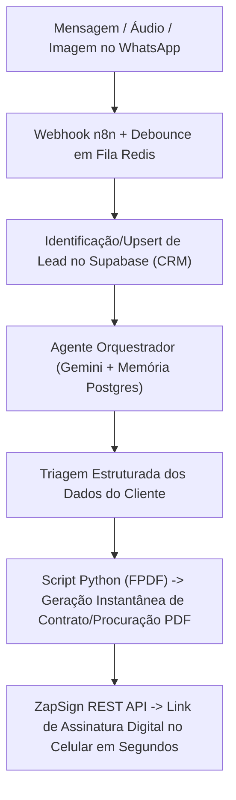

# Arquitetura Multi-Agente de Triagem, Geração de Contratos & Workflows n8n

```mermaid
flowchart TD
    A["Mensagem / Áudio / Imagem no WhatsApp"] --> B["Webhook n8n + Debounce em Fila Redis"]
    B --> C["Identificação/Upsert de Lead no Supabase (CRM)"]
    C --> D["Agente Orquestrador (Gemini + Memória Postgres)"]
    D --> E["Triagem Estruturada dos Dados do Cliente"]
    E --> F["Script Python (FPDF) -> Geração Instantânea de Contrato/Procuração PDF"]
    F --> G["ZapSign REST API -> Link de Assinatura Digital no Celular em Segundos"]
```
